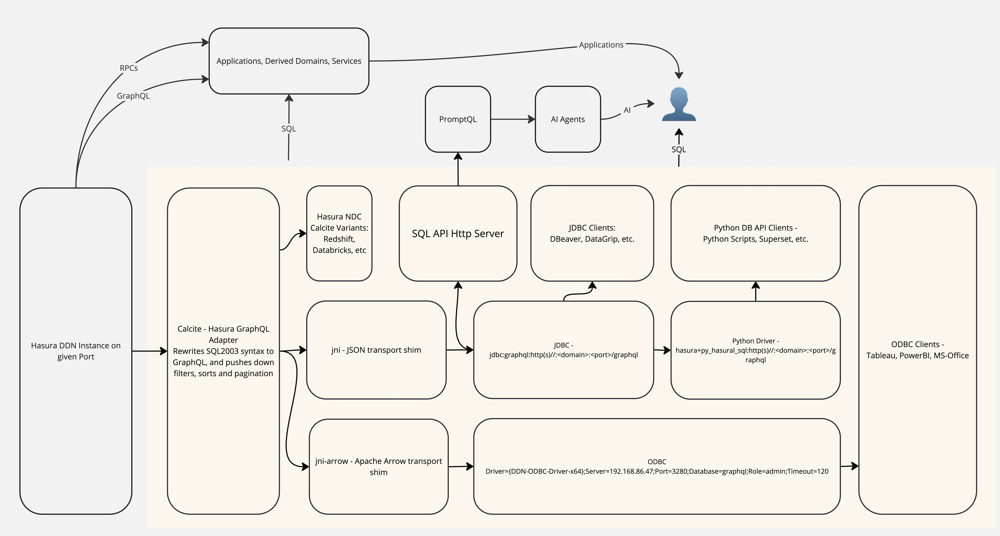

# Hasura Integration Suite

Tools for integrating with Hasura Data Delivery Network (DDN) in three key ways:
1. Native Data Connector (NDC) toolkit for ingesting data sources into Hasura DDN
2. SQL-based tools for querying Hasura DDN endpoints
3. ODBC-based access to Hasura DDN

## Native Data Connector Development

### [NDC Calcite](ndc-calcite.md)
A toolkit for creating Hasura DDN Native Data Connectors using Apache Calcite:
- Support for developing connectors to 15+ file-based data sources
- Support for developing connectors to 25+ JDBC-based data sources
- Metadata-configurable adapter framework
- Built-in testing and validation tools
- Comprehensive connector development documentation

#### Supported Data Sources for NDC Development

File Formats:
| Format    | Status  | Features |
|-----------|---------|----------|
| Arrow     | Tested  | File mount, High Performance |
| CSV       | Tested  | S3, HTTP, file mount, Redis caching |
| JSON      | Tested  | S3, HTTP, file mount, Redis caching |
| XLSX      | Tested  | S3, HTTP, file mount, Redis caching |
| Parquet   | Tested  | File mount (S3 support possible) |

Databases:
- PostgreSQL (Tested)
- Redshift (Tested)
- Databricks (Tested)
- Trino (Tested)
- HIVE (Tested)
- DB2 (Tested)
- SQLite (Tested)
- H2 (Tested)
- Cassandra (Tested)

[View full database support matrix](ndc-calcite.md#databases)

## SQL Access Tools for Hasura DDN

### [Hasura GraphQL SQL Adapter](calcite-rs-jni/calcite/graphql/README.md)
Apache Calcite adapter optimized for querying Hasura DDN endpoints using SQL:
- SQL:2003 compliance with extensive feature support
- Window functions and common table expressions
- Flexible caching system (in-memory and Redis)
- Advanced query optimization
- Comprehensive type system

### SQL Access Interfaces

#### JDBC Connector
JDBC driver for SQL access to Hasura DDN endpoints:
- Standard JDBC interface
- Authentication via headers (Bearer tokens, API keys)
- Role-based access control
- Query result caching
- Integration with standard JDBC tooling

#### Python DB-API
Python DB-API 2.0 implementation for SQL access to Hasura DDN endpoints:
- Python 3.9+ support
- Context manager support
- Type hints for better IDE integration
- Clear error handling
- Thread-safe design

#### SQL HTTP Server
Lightweight HTTP server for executing SQL queries against Hasura DDN endpoints via REST:
- JSON-based request/response format
- Read-only query execution
- Authentication and role-based access
- Connection pooling
- Environment-based configuration

## ODBC-based Access to Hasura DDN

### [DDN ODBC Driver](calcite-rs-jni/odbc/README.md)
The DDN ODBC Driver is a .NET Standard 2.0 library that provides an ODBC-compliant interface to interact with the Hasura DDN platform. This driver allows you to execute SQL queries and retrieve data from your Hasura DDN instance using a familiar ODBC-based API.

#### Features
- Supports ODBC API for executing SQL queries and retrieving data
- Provides a simple and intuitive connection management interface
- Automatically starts and manages a Java application server in the background
- Supports reading metadata (tables, columns) from the Hasura DDN instance
- Operates in a read-only mode to ensure data integrity

For detailed usage instructions, please refer to the [DDN ODBC Driver README](DDN-ODBC/README.md).

## Getting Started

Each component has its own setup and configuration requirements. Please refer to the individual component documentation linked above for detailed instructions.

## Common Features

- Authentication and authorization support
- Query result caching
- Clear error handling
- Comprehensive documentation
- Production-ready implementations

## Development

For development setup and contribution guidelines, please refer to each component's documentation:
- [NDC Calcite Development](ndc-calcite.md#temporary-instructions---for-getting-started-as-a-developer-with-this-repo)
- [JDBC Connector Development Guide](calcite-rs-jni/jdbc/README.md#building-from-source)
- [Python DB-API Development](calcite-rs-jni/py_graphql_sql/README.md#prerequisites)
- [SQL HTTP Server Development](calcite-rs-jni/sqlengine/README.md#building-and-running)
- [DDN ODBC Driver Development](DDN-ODBC/README.md)

## License

Different components are released under different licenses:
- Apache Calcite Adapter: Apache License 2.0
- GraphQL JDBC Connector: Apache License 2.0
- Python DB-API: MIT License
- SQL HTTP Server: MIT License
- NDC Calcite: License information not specified
- DDN ODBC Driver: License information not specified

## Support

For support options:
- File issues on the respective GitHub repositories
- Contact Hasura support at support@hasura.io for commercial support
- Join the community discussions on calcite.apache.org/community/
