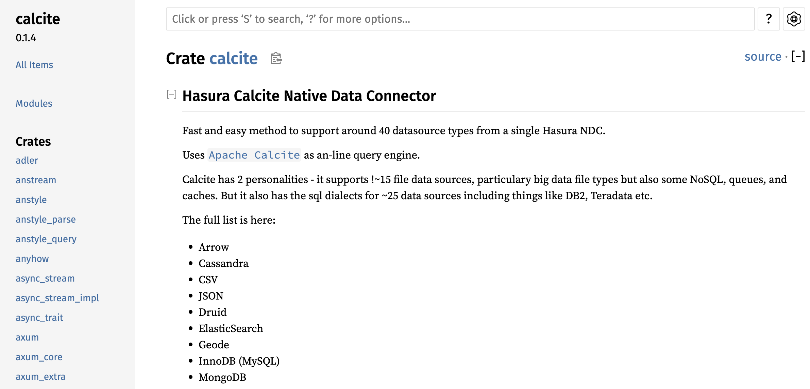

# NDC Calcite Connector

The Calcite connector implements a generic connector for ALL Calcite data sources. You modify the configuration.json/model to
change the underlying Calcite data source.

## Getting Started

We can build a file connector (creates schemas for one or directories of JSON and CSV files). Of course, you can build all types of connectors for data sources that Calcite supports.

### With Cargo

```sh
(cd crates/ndc-calcite; cargo build; cd ..; cd ..; cd adapters/file; cargo run --package ndc-calcite --bin ndc-calcite -- serve --configuration .)
```

### Rust Docs

```sh
cd crates/ndc-calcite
cargo doc
open "../../target/doc/calcite/index.html"
```



### With Docker

```sh
cd adapters/file
./build.sh
docker compose -f dev.docker-compose.calcite.yaml up
```

## Using the calcite connector

The file_connector connector runs on http://localhost:8080 by default:

```sh
curl http://localhost:8080/schema | jq .
```
